# Automated Parcel Storage and Collection System


## Overview

The Automated Parcel Storage and Collection System is an IoT-based embedded systems project developed using two Raspberry Pi Pico microcontrollers. The system automates parcel delivery, storage, notification, and collection processes inside a university environment.

The project integrates UART communication, conveyor automation, secure PIN authentication, multi-language Telegram Bot services, and automatic parcel storage management to provide a smart and efficient parcel handling solution.

The system consists of two independent controllers:

- Pico 1 – Parcel Delivery Controller
- Pico 2 – Parcel Storage and Collection Controller

Both controllers communicate through UART to coordinate parcel transfer and storage operations.

---

## Features

### Parcel Delivery System (Pico 1)

- Student ID verification
- Parcel detection using Laser and LDR
- Automated delivery gate
- Conveyor belt automation
- Storage availability checking
- UART communication with Pico 2

### Parcel Storage and Collection System (Pico 2)

- Automatic parcel storage allocation
- Random 4-digit PIN generation
- Secure parcel collection
- Wrong PIN detection
- Security alarm activation
- Automatic storage shifting mechanism
- Storage status monitoring

### IoT and Telegram Integration

- Parcel arrival notification
- Parcel collection notification
- Parcel relocation notification
- Security alarm notification
- Multi-language support
- Storage status command
- Reminder system

### Security Features

- PIN-based authentication
- Three-attempt lock protection
- Alarm activation
- Red warning LED indication
- Admin override PIN
- Unauthorized access detection

---

## System Architecture

```text
Delivery Personnel
        │
        ▼
     Pico 1
(Parcel Delivery)
        │
     UART
        │
        ▼
     Pico 2
(Storage Controller)
        │
        ▼
 Telegram Bot
        │
        ▼
      User
```

---

# Hardware Components

## Pico 1 Components

- Raspberry Pi Pico
- 16×2 I2C LCD
- 4×4 Matrix Keypad
- Laser Module
- LDR Sensor
- Servo Motor
- Two Stepper Motors
- Two ULN2003 Drivers

## Pico 2 Components

- Raspberry Pi Pico W
- 16×2 I2C LCD
- 4×4 Matrix Keypad
- Five Servo Motors
- Buzzer
- Red LED
- Green LED
- WiFi Connectivity
- Telegram Bot Integration

---

# Complete Hardware Layout

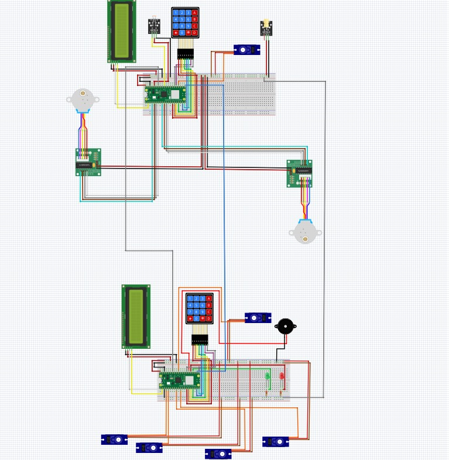

---

# Complete Circuit Schematic


---

# Pico 1 Hardware

## Pico 1 Hardware Layout

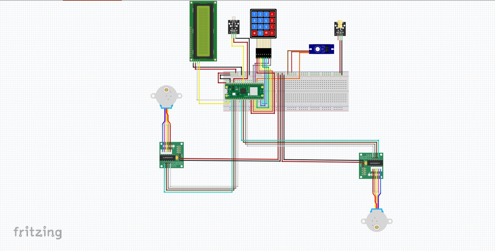

### Pico 1 Wiring Diagram

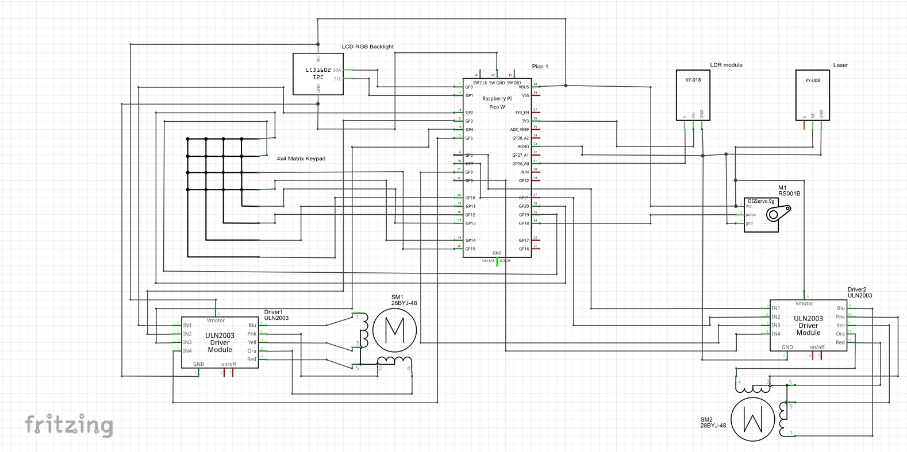

### Pico 1 Flowchart

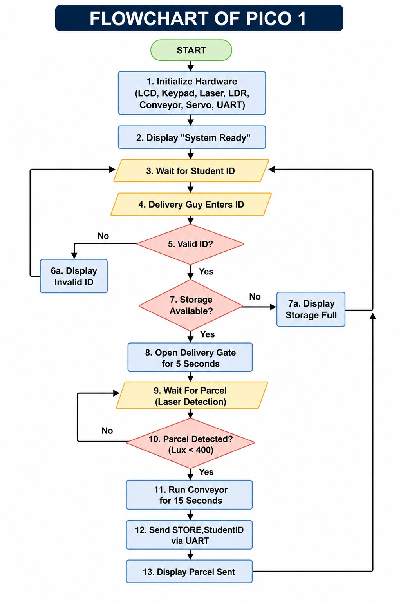

### Pico 1 Functions

1. Validate student ID
2. Check storage availability
3. Open delivery gate
4. Detect parcel using Laser/LDR
5. Run conveyor mechanism
6. Send storage request to Pico 2
7. Display delivery status

---

# Pico 2 Hardware

## Pico 2 Hardware Layout

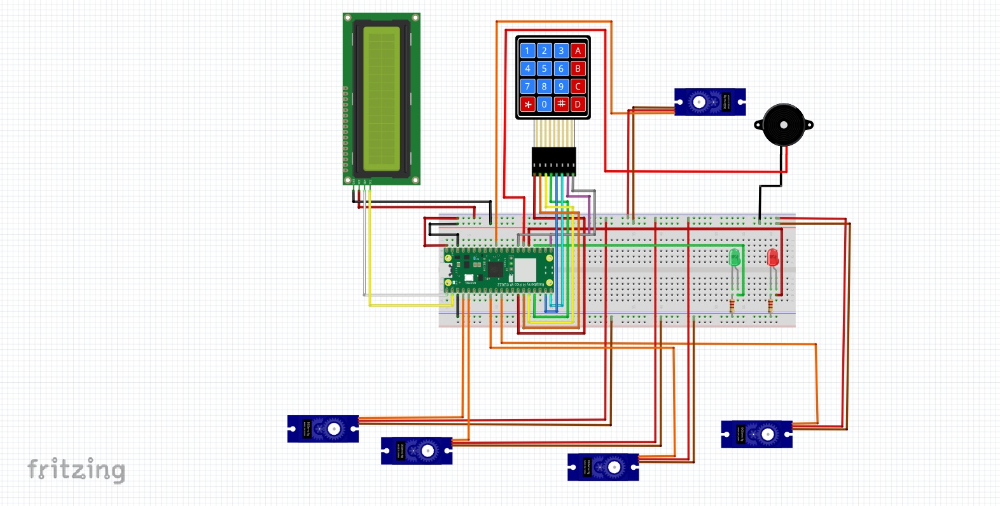

### Pico 2 Wiring Diagram

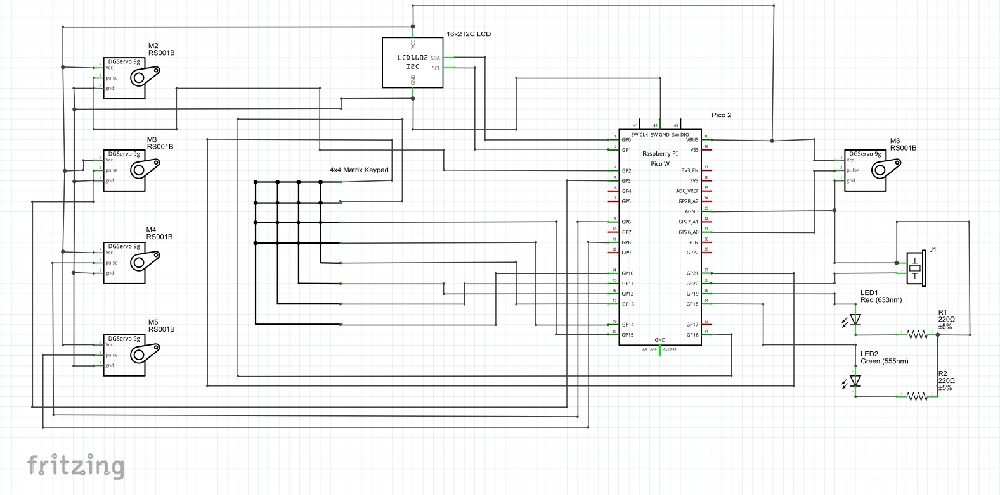

### Pico 2 Flowchart

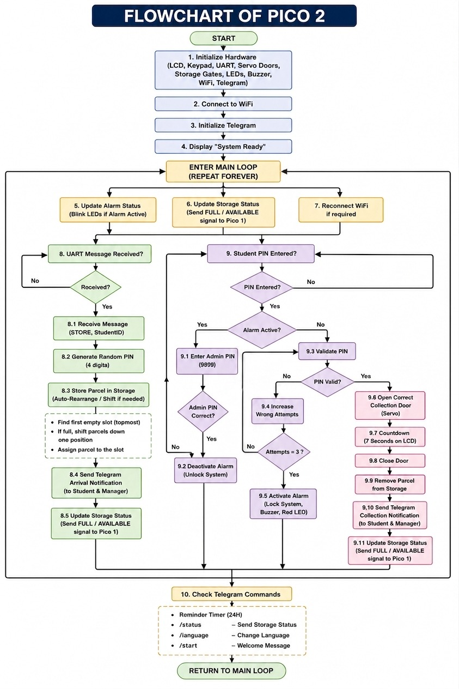

### Pico 2 Functions

1. Receive storage request
2. Generate secure PIN
3. Store parcel automatically
4. Send Telegram notifications
5. Handle parcel collection
6. Activate security alarm
7. Monitor storage availability
8. Process Telegram commands

---

# Telegram Bot Features

## Arrival Notification

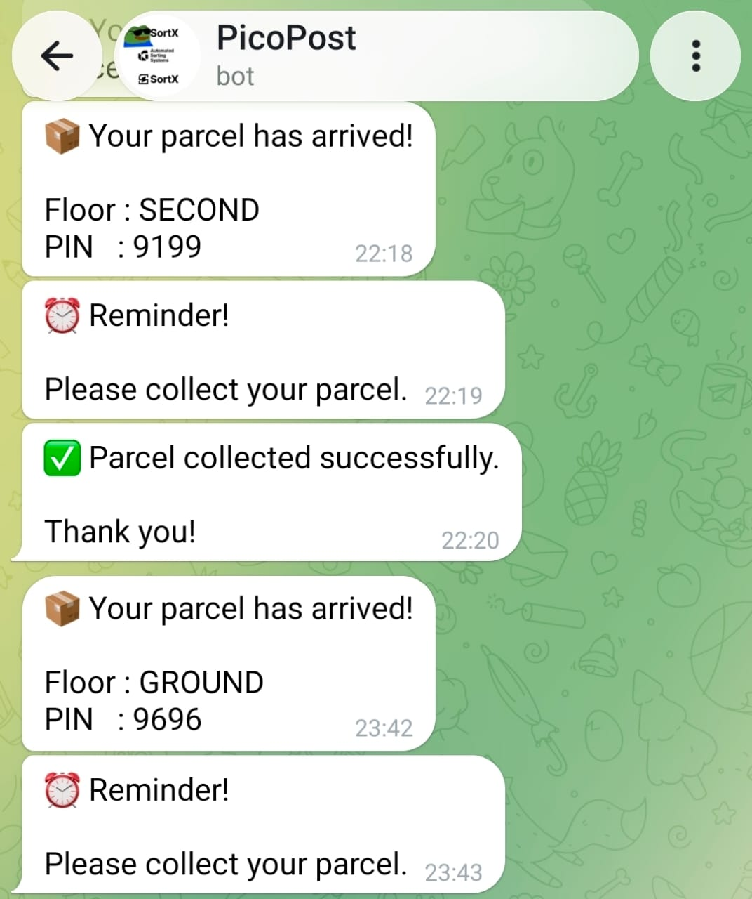

Users receive a notification when a parcel is successfully stored.

---

## Multi-Language Support


Supported languages:

- English
- Arabic
- Hindi
- Chinese
- Bahasa Melayu

---

## Parcel Update Notification

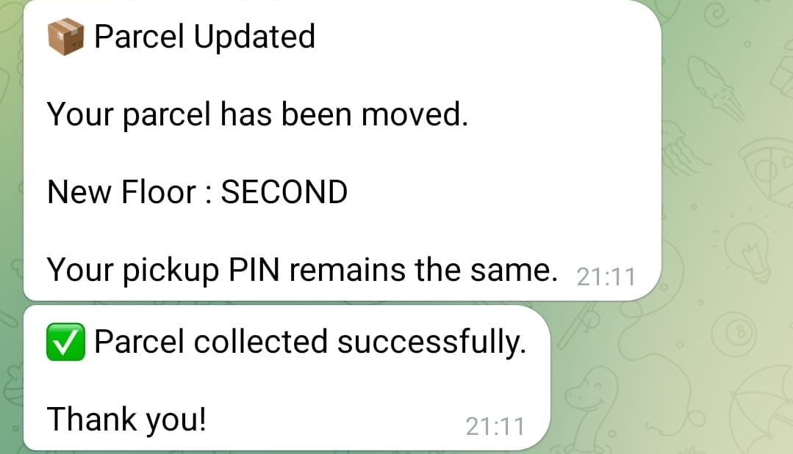

Users are notified when a parcel is automatically relocated within the storage system.

---

## Security Alert

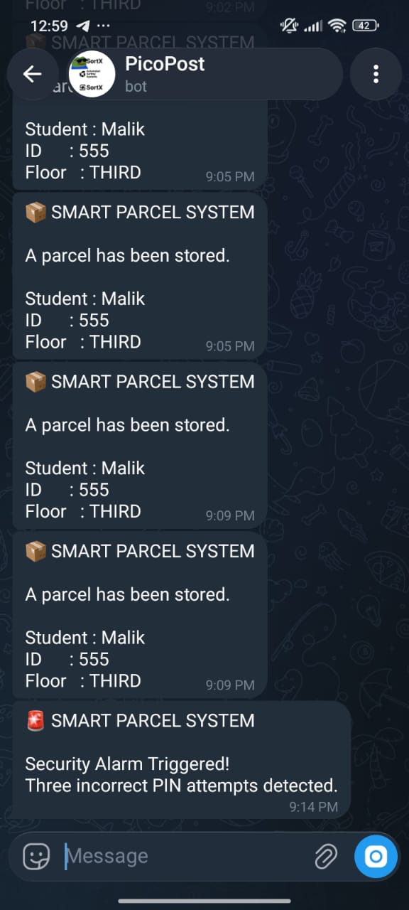

The system sends an alert whenever three incorrect PIN attempts are detected.

---

# Physical Prototype

## Top View

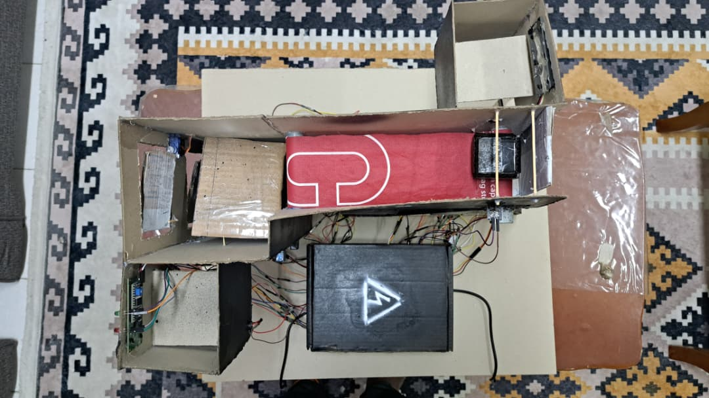

## Front View

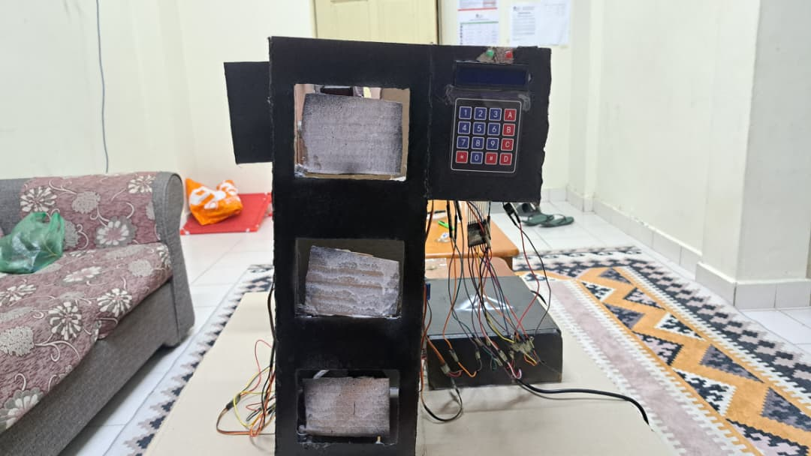

## Rear View

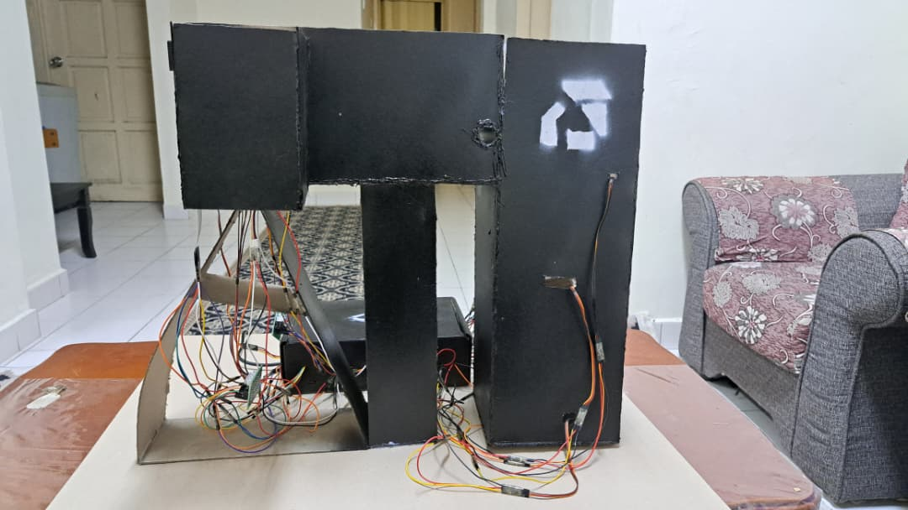

---

# Software Structure

## Pico 1

```text
Pico1
│
├── Main_Code_Pico1.py
│
└── OOPs_Codes
    ├── config.py
    ├── conveyor.py
    ├── delivery.py
    ├── gate.py
    ├── laser.py
    ├── lcd.py
    ├── matrix_keypad.py
    └── uart.py
```

## Pico 2

```text
Pico2
│
├── Main_Code_Pico2.py
│
└── OOPs_Codes
    ├── buzzer.py
    ├── config.py
    ├── lcd.py
    ├── locker.py
    ├── matrix_keypad.py
    ├── pickup.py
    ├── servo.py
    ├── telegram.py
    ├── uart.py
    └── wifi_connect.py
```

---

# Project Report

The complete technical report is available in:

```text
Report.pdf
```

The report includes:

- Introduction
- Literature Review
- System Design
- Hardware Development
- Software Development
- Experimental Results
- Discussion
- Conclusion
- References

---

# Demonstration Video

```text
[Insert YouTube Demonstration Link Here](https://youtu.be/w89yXCtu_S8?si=etVViC6-UAvduJDZ )
```


---

# Technologies Used

- Raspberry Pi Pico
- Raspberry Pi Pico W
- CircuitPython
- UART Communication
- Telegram Bot API
- Embedded Systems Design
- Object-Oriented Programming
- IoT Integration
- WiFi Communication

---

# License

This project is released under the MIT License.
